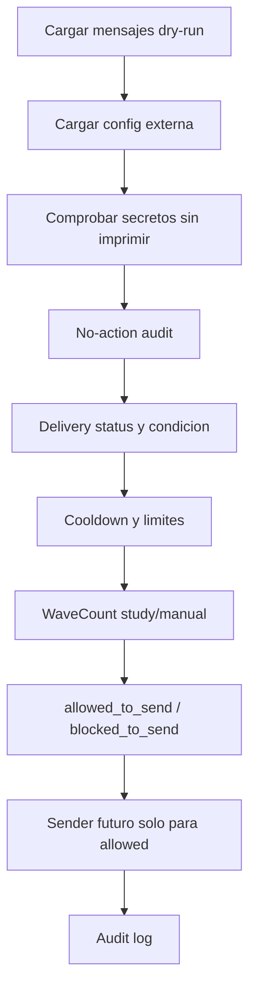

# Telegram Sender Gate Design V1

Fecha: 2026-05-29

Decision: `telegram_sender_gate_design_ready_for_implementation`.

## Resumen

Se disena `telegram_sender_gate_v1` como puerta de autorizacion previa a
cualquier envio real por Telegram. Esta fase no implementa sender, no conecta
Telegram, no envia mensajes, no pide tokens, no crea `.env`, no guarda chat IDs
y no introduce bot, MT5, SQL writes, DDL, backtests ni senales.

El gate responde una sola pregunta: si un mensaje informativo ya renderizado y
auditado puede cruzar a un sender real futuro. Por defecto, la respuesta debe
ser bloquear salvo que todas las condiciones obligatorias pasen.

## Que Es

- Puerta de autorizacion para envio informativo real futuro.
- Validador de mensajes, configuracion externa, delivery status, cooldown,
  no-action y auditoria.
- Mecanismo fail-closed antes de un sender.

## Que No Es

- No es bot.
- No es estrategia.
- No decide operaciones.
- No conecta MT5.
- No aprueba setups.
- No usa WaveCount como filtro.
- No reemplaza el dashboard read-only.

## Condiciones Para Permitir Envio

Un mensaje futuro solo podria enviarse si, entre otras condiciones:

- `telegram_enabled=true` y `telegram_mode=informational_only`.
- Token y chat id existen fuera del repo y no se imprimen.
- Existe flag explicito futuro `--send-real`.
- `safe_to_send=true`.
- `delivery_status=preview_allowed`.
- `condition_status` no es `no_condition`.
- Cooldown y max diario pasan.
- No-action audit pasa.
- WaveCount, si aparece, es `study_only/manual` y esta habilitado explicitamente.
- Bot, MT5, SQL write y DDL siguen apagados.

## Bloqueos

El gate debe bloquear si falta secreto externo, si aparece un secreto dentro del
repo, si el mensaje no es `preview_allowed`, si es `manual_only` sin
confirmacion, si hay wording operativo, si WaveCount no es study-only, si bot o
MT5 estan activos, si hay SQL writes/DDL o si faltan artifacts de auditoria.

## Flujo Futuro

## Auditoria Futura

Si algun dia se envia real, debe registrarse `send_attempt_id`, `message_id`,
`gate_decision`, `gate_reason`, `send_real_requested`, `send_real_executed`,
respuesta de Telegram sin secretos, hashes cuando proceda, `token_printed=false`
y `chat_id_printed=false`.

## Riesgos

Los riesgos principales son fuga de secretos, spam, wording operativo accidental,
WaveCount entendido como senal, uso de Telegram como pseudo-bot y sensacion falsa
de sistema vivo. Las mitigaciones quedan en `sender_gate_risk_register.csv`.

## Siguiente Paso

Puede implementarse `telegram_sender_gate_v1` en una fase posterior, siempre con
secretos externos, envio real desactivado por defecto, confirmacion explicita y
bot/MT5 fuera de alcance.
